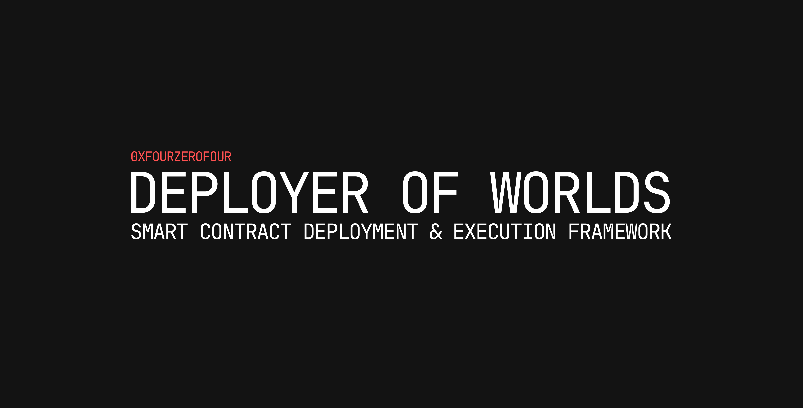

A config driven smart contract deployment and execution framework for repeatable to deterministic actions.

## Example Config

```yml
variables:
  proxy_address:
    ty: address
    value: "0x4f84a207A80c39E9e8BaE717c1F25bA7AD1fB08F"

  entry_point:
    ty: address
    value: "0x5FF137D4b0FDCD49DcA30c7CF57E578a026d2789"

  min_value:
    ty: uint256
    value: "1000000000000000000"

actions:
  - id: "read_entrypoint_deposit_info"
    action_data:
      type: "read"
      content:
        address: !var entry_point  
        abi_item: "function balanceOf(address owner) view returns (uint256 balance)"
        args:
          - !var proxy_address 

  - id: "send_deposit"
    action_data:
      type: "write"
      content:
        address: !var entry_point
        abi_item: "function deposit(address owner) payable"
        args:
          - !var proxy_address
        value: !output read_entrypoint_deposit_info.balance
```


## TODO

- Input validation based on id's and output schema based on jq queries 
- Generate init code based on input abi and constructor args
- Conditional Execution logic based on on-chain read funcitonality
- CREATE2 Deployer implementation for contract deployment
- CLI tool to allow for arbitrary json inputs to be executed
- Use Create2 deployer factory and bind rust types to it (here)[https://github.com/pcaversaccio/createx]
